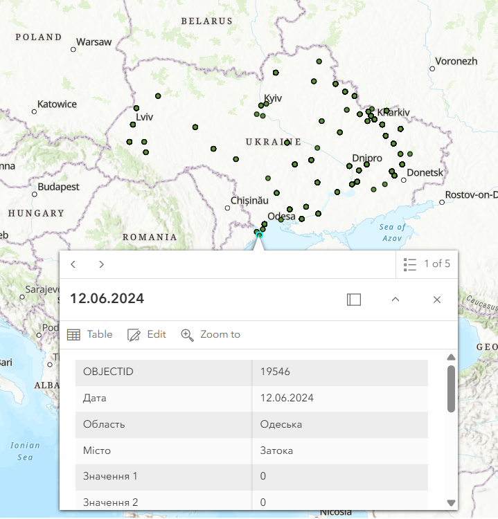

Этот скрипт загружает данные из Google Sheets, преобразует их в расширенную таблицу по правилу **"unit ladder"**, а затем добавляет их в слой ArcGIS как объекты `Feature`.

---

## 🔹 Установка

### 1. Клонируйте репозиторий

```bash
git clone https://github.com/Baranotik15/Test_for_M1MT
cd Test_for_M1MT
```

### 2. Создайте виртуальное окружение

```bash
python -m venv .venv
```

### 3. Активируйте виртуальное окружение

* **Windows:**

```bash
.venv\Scripts\activate
```

* **Mac / Linux:**

```bash
source .venv/bin/activate
```

### 4. Установите зависимости

```bash
pip install -r requirements.txt
```

---

## 🔹 Настройка `.env`

Создайте файл `.env` в корне проекта (или используйте существующий):

```bash
touch .env
```

Добавьте переменную `item_id` — ID элемента ArcGIS, куда будут добавляться данные:

```dotenv
item_id="2250ee027e04401dae8c72e09159af25"
```

> ⚠️ Файл должен быть похож на `env_sample`.

---

## Тесты
Перед запуском кода убедитесь что код проходит тесты
```bash
python -m pytest
```

## 🔹 Запуск скрипта

Запустите основной файл:

```bash
python main.py
```

Скрипт запросит URL от Google Sheet. Введите его в формате:

```text
https://docs.google.com/spreadsheets/d/12846JbH2PwR0wN8eLVnosg4xujw-04gKyyD6RuElc-4/edit?gid=0#gid=0
```

После этого скрипт:

* Парсит Google Sheet URL и получает `sheet_id` и `gid`.
* Загружает таблицу в `pandas.DataFrame`.
* Преобразует колонки `long` и `lat` в числовой формат.
* Применяет правило "unit ladder" для колонок `Значення 1-10`.
* Мапит данные для коректного заполнения слоев в ArcGIS
* Загружает данные в слой ArcGIS пакетами по 500 объектов.

---

## 🔹 Структура Google Sheet

Таблица должна содержать следующие колонки:

* `Дата`
* `Область`
* `Місто`
* `Значення 1` … `Значення 10`
* `long` — долгота (например, 30.5234)
* `lat` — широта (например, 50.4501)

---


## 🔹 Примечания

* Если данные в колонках `long` и `lat` имеют запятую как десятичный разделитель, скрипт автоматически заменяет её на точку.
* Пустые значения в колонках `Значення 1-10` заменяются на 0.
* Ошибки при добавлении объектов выводятся в консоль, остальные пакеты продолжают загружаться.

## 🔹 Пример результата
